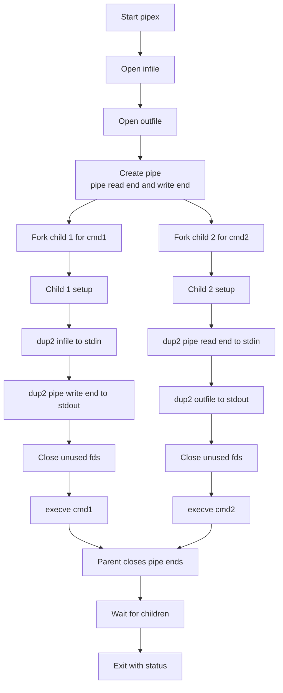

# pipex - Recreating Shell Pipelines

  
📌 **42 School - Process & Piping Project**  

## ▌ Description
The **pipex** project is about handling **UNIX pipes** (`|`) to establish communication between processes.  
It replicates the behavior of the following shell command:  
<!--  -->



```sh
< file1 cmd1 | cmd2 > file2  
```

This project was a great opportunity to explore **process creation, file redirection, and inter-process communication**.

## ▌ Key Features
▸ **Mimics UNIX pipe behavior (`|`)**  
▸ **Uses `fork()`, `pipe()`, `dup2()`, and `execve()`**  
▸ **Handles file redirections (`<` and `>` in shell)**  
▸ **Manages error handling and process cleanup correctly**  

## ▌ Result: **100% Score**
The project was successfully validated with a **100% score**, meeting all evaluation criteria. 🎉

## ▌ Files
- `pipex.h` → Function prototypes and shared structures  
- `pipex.c` → Entry point: argument check, processes and waiting  
- `pipes_and_check.c` → Pipe creation and file/command checks  
- `execute_cmd.c` → Command path lookup and `execve()`  
- `utils1.c` … `utils5.c` → String and memory helpers  
- `Makefile` → Automates compilation (`all`, `clean`, `fclean`, `re`)  

## ▌ Implementation Details
The `pipex` program **creates a pipeline between two commands**, just like in a shell:
1. **Opens `file1` and `file2`**.
2. **Creates a pipe** to establish communication.
3. **Forks child processes** for `cmd1` and `cmd2`.
4. **Redirects input/output** correctly using `dup2()`.
5. **Executes commands** using `execve()`.
6. **Waits for processes to complete**.

### ■ **Mandatory Part**
| Feature | Description |
|---------|-------------|
| `pipe()` | Creates a unidirectional pipe |
| `fork()` | Creates child processes to execute commands |
| `dup2()` | Redirects file descriptors for input/output |
| `execve()` | Executes commands like a shell |

### ■ **Bonus**
Not implemented. This version takes exactly two commands (`./pipex file1 cmd1 cmd2 file2`); the subject's bonus (multiple pipes and `here_doc`) is not supported.

## ▌ Compilation & Usage
### ■ **Compile the Program**
make  

### ■ **Run pipex**
Example usage with two commands:
```sh
./pipex infile "ls -l" "wc -l" outfile  
```

Equivalent to:
```sh
< infile ls -l | wc -l > outfile  
```

## 📜 License

This project was completed as part of the **42 School** curriculum.  
It is intended for **academic purposes only** and follows the evaluation requirements set by 42.  

Unauthorized public sharing or direct copying for **grading purposes** is discouraged.  
If you wish to use or study this code, please ensure it complies with **your school's policies**.
